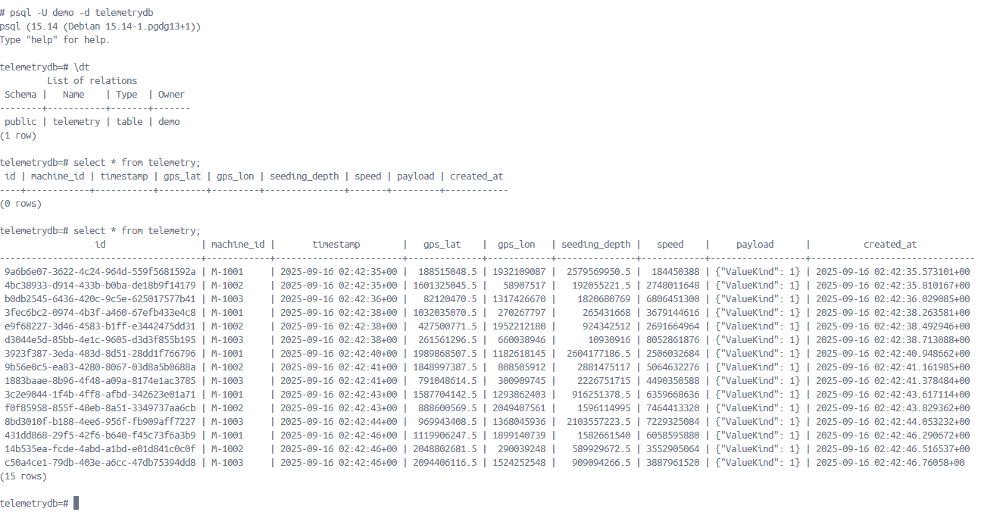

# Telemetry

Monorepo containing a simple ASP.NET backend and a React + Vite frontend for browsing device telemetry and testing data ingestion.

## Contents

- backend/ — .NET Web API that receives and serves telemetry data.
- frontend/ — Vite + React frontend that calls the API and displays devices/points.
- simulate_device.ps1 — PowerShell script to post sample telemetry for local testing.
- docker-compose.yml — compose file to run services with Docker if present.

## Prerequisites

- .NET SDK (check TelemetryApi global.json or project files for required version)
- Node.js 18+
- npm, yarn or pnpm
- Docker

## Quick start (local)

1. Docker

   ```bash
   docker compose up --build
   ```

   See docker-compose.yml at repository root for service ports and configuration.

   you will get two images: postgres and telemetry-api and two containers: db-l and api-1.

   db-1 is a PostgreSQL DB to manage telemetry data.

   api-1 is a ASP.NET backend service

2. Start backend

   ```bash
   cd backend
   dotnet run
   ```

   Check the actual listening URL/port in TelemetryApi/Properties/launchSettings.json or console output.

3. Post fake telemetry data to backend service

   ```powershell
   .\simulate_device.ps1
   ```

   Check DB tables
   
   you can change this script for your own data
   Or use your own client to POST telemetry to the API endpoints.

4. Start the frontend

   ```bash
   cd frontend
   npm install
   npm run dev
   ```

   Frontend typically served at http://localhost:5173.

   Screenshot
   

## Project notes

- Frontend uses API helpers in frontend/src/api.js: fetchMachines, fetchRange, fetchLatest.
- Backend controllers are in backend/Controllers (e.g., TelemetryController.cs).
- Adjust API base URL in telemetry-frontend/src/api.js when backend runs on a different host/port.

## Contributing

Open issues or PRs. Run local servers to verify changes before submitting. Keep changes small and include tests where appropriate.

## License

See the repository root license file
